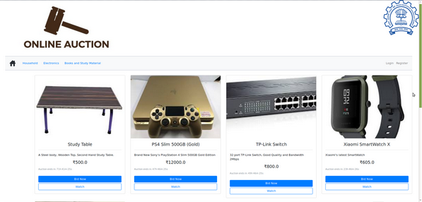
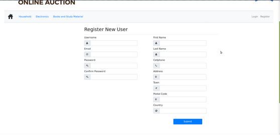

# E-Auction-website
Implemented an e-Auction site using django

The auction site allows new users to view present items up for auction and to sign if interested in any item.

Registered users can bid on items, comment on any item as well as set up any product for auction. For every new product,
seller needs to specify type of product, product description, base price, auction deadline and a picture.

When a registered user tries to bid on a product for the first time, the current price will be deducted from their wallet.
For every subsequent bid, only the difference will be charged to the user.

Once an auction is over, the product page will display the winning bidder.
